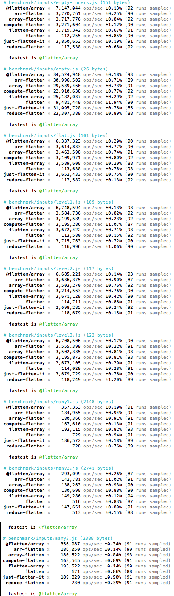

# @flatten/array
[](https://travis-ci.org/elidoran/flatten-array)
[](https://gemnasium.com/elidoran/flatten-array)
[](http://badge.fury.io/js/%40flatten%2Farray)
[](https://coveralls.io/github/elidoran/flatten-array?branch=master)

Quickly flatten an array in-place.

View [many implementation variations](https://github.com/elidoran/array-flatten/tree/add-more/benchmark/code/flatten) and use it to run benchmarks. This implementation is named `inplace2.js` there.

Run `npm run perf` to compare the performance of this implementation to both [array-flatten](https://www.npmjs.com/package/array-flatten) and [flatten-array](https://www.npmjs.com/package/flatten-array).


## Install

```sh
    npm install @flatten/array --save
```


## Usage

```javascript
var flatten = require('@flatten/array')

console.log(flatten([1, [2, 3], [4, [5, [6, 7]]]]))
// [ 1, 2, 3, 4, 5, 6, 7 ]

// NOTE: it's an in-place change to the array supplied.
var array = [ 1, [2, 3], 4, [5, [6, [7], 8], 9], 10 ]
flatten(array)
// array = [ 1, 2, 3, 4, 5, 6, 7, 8, 9, 10 ]
// no need to assign array to it.
// but, you can, if you want to because it returns it
// to allow inline use.
```


## Performance

**tl;dr** This is the fastest flatten implementation.

An in-place flatten on the top-most array is significantly faster than producing a new array with the flattened results. Run this project's performance test to see it compared to both [array-flatten](https://www.npmjs.com/package/array-flatten) and [flatten-array](https://www.npmjs.com/package/flatten-array).

Also, use [my fork](https://github.com/elidoran/array-flatten/tree/add-more/benchmark/code/flatten) of the `array-flatten` project to compare this implementation, called `inplace2.js` there, against many other implementations.

Normally it's an anti-pattern to alter a provided array unless it is the specific intent (such as a sort utility). In this case, it is both the specific intent, the fastest implementation, and it fits the common use pattern.

The third reason, "common use pattern", means it's common to create a new array which contains many other things which may, or may not, be arrays. Then, that top-most array is provided to `@flatten/array`. So, it's a brand new array created to contain the results and is therefore a perfect candidate to mutate to hold the final results.

For example:

```javascript
buildSomething([ // top-most array is a great target
  // all these may or may not provide arrays
  require('some-plugin'),
  require('./local-addons'),
  [ 'something', 'defined', 'here' ]
  makeSomeMore()
])
```

Performance results:




## [MIT License](LICENSE)
